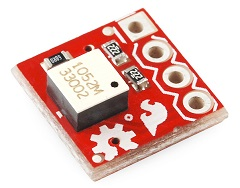

# Tilt-a-Whirl-Hookup-Guide-for-Raspberry-Pi
How to set up the Spark Design Tilt-a-Whirl Hookup to run with Python and a Raspberry Pi
Originally designed to run with Arduino, looked everywhere for a Python version.  
Wrote my own instead!

#Hook up Guide

VCC pin to 3v
GND pin to ground
S1 to GPIO 4
S2 to GPIO 25
